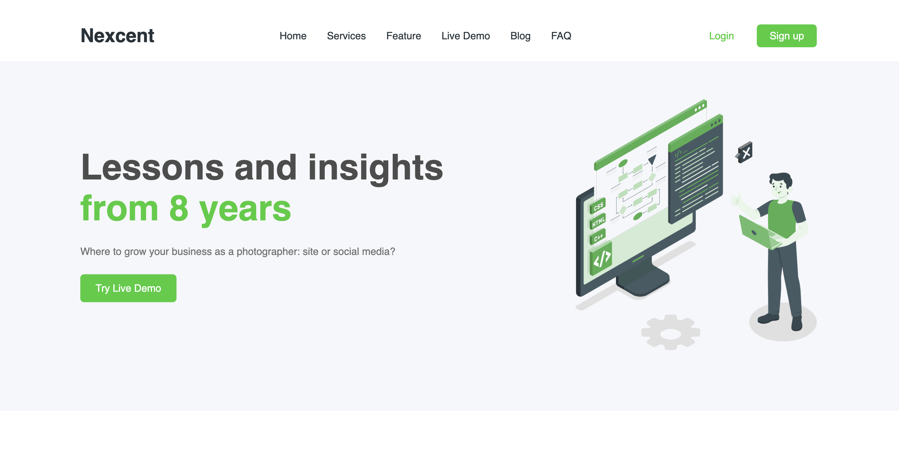
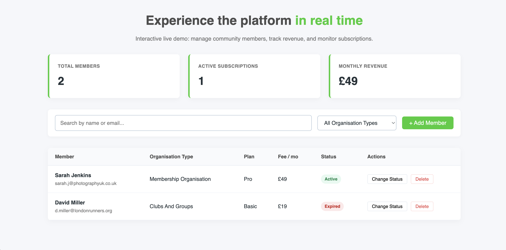

Nexcent — Community Management Platform

A responsive SaaS landing page with a working, client-side member management dashboard. Built with semantic HTML5, CSS3 (BEM), and vanilla JavaScript — no frameworks, no build step.

Live Demo
Live URL: https://aj23act.github.io/nexcent/
Repository: https://github.com/aj23act/nexcent
Features

Interactive Dashboard
Add, toggle status, and delete members through an accessible modal form.
Live search (by name/email) and filter by organisation type.
Metrics (total members, active subscriptions, monthly revenue) recalculate automatically as data changes.
State persists in localStorage, with a guard against corrupted/invalid stored data on load.
Accessibility Details
Mobile nav drawer: aria-expanded on the toggle, backdrop click-to-close, Escape key support.
Modal dialog: role="dialog", aria-modal="true", aria-hidden kept in sync with actual visibility, autofocus on first field.
User-submitted text is HTML-escaped before being inserted into the DOM (prevents stored XSS via the add-member form).
CSS Architecture
BEM naming convention throughout.
CSS custom properties for color/spacing tokens, including a small z-index scale to keep stacking order (header, mobile nav, backdrop, modal) predictable.
Mobile-first responsive breakpoints at 1024px and 900px.
Tech Stack
Technology	Purpose
HTML5	Semantic structure, ARIA attributes, inline SVG icons
CSS3	Custom properties, Flexbox, CSS Grid, BEM
JavaScript (ES6+)	DOM manipulation, event delegation, map/filter/reduce, localStorage

No frameworks, no bundler — plain files you can open directly.

Running Locally

No build step required.

bash
git clone https://github.com/your-username/nexcent.git
cd nexcent

Then just open index.html in a browser, or serve the folder with any static server, e.g.:

bash
npx serve .
Project Structure
nexcent/
├── index.html          # Markup, modal dialog
├── css/
│   ├── style.css       # BEM stylesheet, layout, responsive rules
│   └── fonts.css        # Typography (Inter)
├── src/js/
│   └── app.js           # Navigation, dashboard state, CRUD logic
├── icons/                # SVG icons
├── images/               # Illustrations and assets
└── README.md
Known Limitations
Data lives only in the browser's localStorage — there's no backend, so records don't sync across devices or browsers. This is a front-end demo, not a production data layer.
No automated tests yet.
No build/bundling step — fine for a project this size, would need one (Vite, etc.) if it grew significantly.
Author

Built by Abdulbosit as a self-directed front-end project.